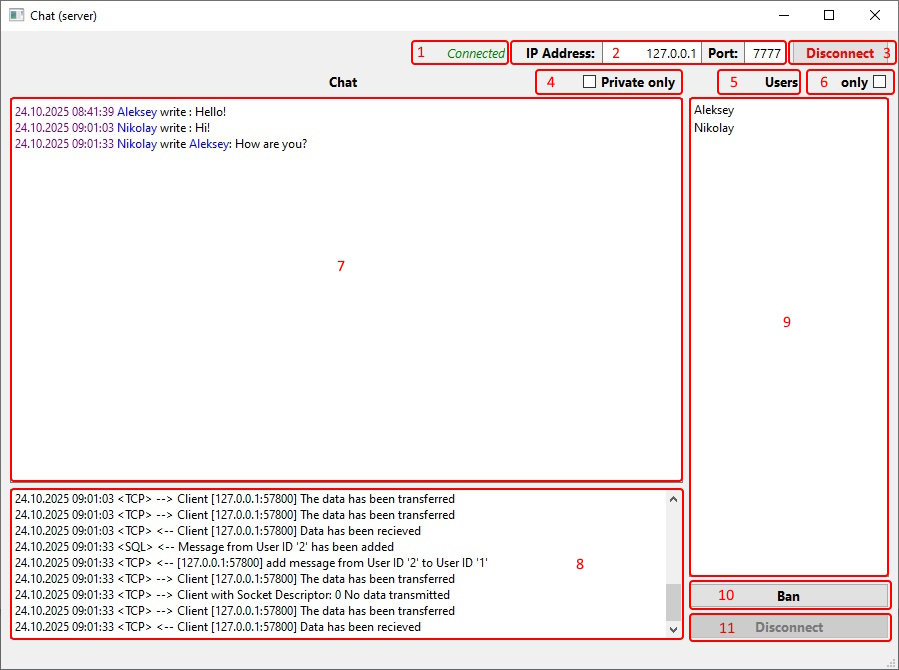
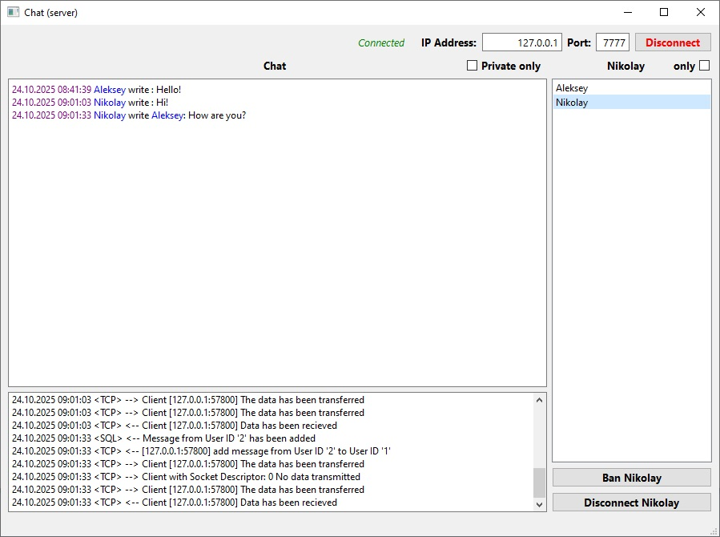

# KDV.Qt_Chat-36_7-PJ-Client KDV.Qt_Chat-36_7-PJ-Server

## Итоговый проект PJ (36.7)

- ОС             : Windows 10 Домашняя 22H2
- IDE            : Qt Creator 17.0.1 (Qt 6.9.3 MSVC2022_64bit Версия 17.14.15)
- C++            : 20
- База данных    : QSqlDatabase SQLite
- TCP сервер     : QTcpServer
- TCP клиент     : QTcpSocket
- Интерфейс      : графический (Qt)
- Принцип работы : сервер-клиент

Разработчик: Дмитрий Кучуро

### Итоговый проект курса "Разработчик на С++".
Клиент-серверный чат с подключением через ТСР-сервер, хранением данных в базе данных.

Реализованы основные требования к проекту.

### В серверной части реализовано:

- В сервере установлены настройки по умолчанию, с сохранением настроек в файле server.config при первом запуске
- Параметры подключения, пути файлов журнала событий и базы данных можно изменить в файле
- Ведение журнала событий с фиксацией даты и времени
- Сохранение журнала событий в файле server.log
- Хранение данных в базе данных - файл chatDB.data
- Настройка параметров подключения сервера
- Просмотр пользователей
- возможность блокирования и разблокирования пользователя
- Возможность отключения пользователя
- Просмотр сообщений от всех пользователей
- Фильтрация сообщений по пользователю и приватности 
- Обработка запросов от пользователей с обратной связью
- Отправка сервисных сообщений об активности пользователей

### В клиентской части реализовано:

- Настройка параметров подключения к серверу
- Регистрация и авторизация пользователя
- Пароль хешируется
- В логине и имени разрешены только буквы латинского алфавита, цифры и нижний слэш
- В тексте запрешены символы '#' и '|', так как используются в парсинге данных
- Отправка персональных и общих сообщений
- Прием сообщений
- Фильтрация сообщений по пользователю и приватности 
- При блокировке пользователя блокируется возможность отправки сообщений

### Назначение элементов главного окна сервера:

1. Статус соединения с сетью.
2. Параметры сети.
3. Кнопка подключения к сети / отключения от сети.
4. Флаг отображения персональных сообщений. Может использоваться совместно с флагом Users only.
5. Имя выбранного пользователя.
6. Флаг отображения сообщений выбранного пользователя. Если пользователь не выбран, то отображаются общие сообщения. Может использоваться совместно с флагом Private only.
7. Окно чата.
8. Окно журнала событий.
9. Окно списка пользователей.
10. Кнопка блокирования / разблокирования пользователя. Пользователя можно заблокировать и разблокировать не подключаясь к сети. При блокировании пользователь имеет доступ к просмотру чата без возможности отправлять сообщения.
11. Кнопка отключения от сервера выбранного пользователя. Активируется только если пользователь подключен к серверу.

